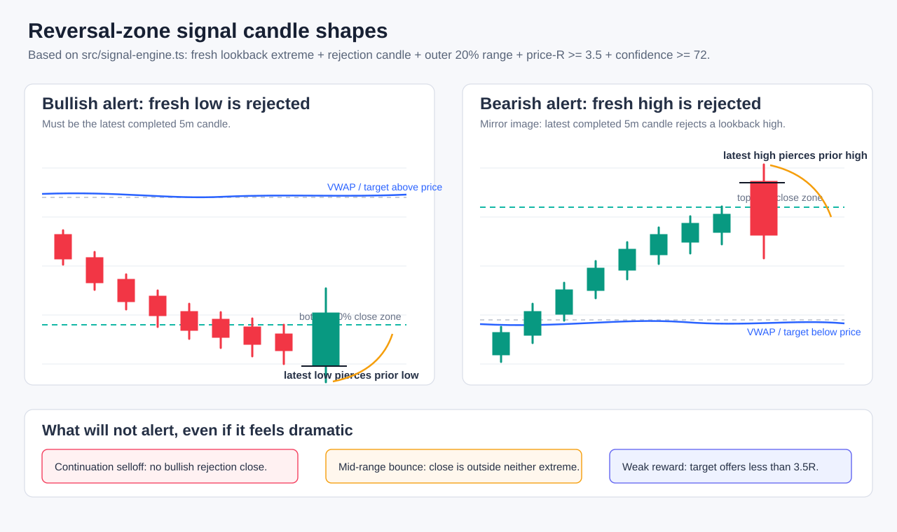

# Hyperliquid SP500 Reversal Scanner

An experimental, read-only Cloudflare Worker that watches Hyperliquid's
`xyz:SP500` five-minute candles for extreme-price rejection setups. It can send
watch alerts, stricter reversal-zone alerts, status briefs, and deployment
notices to a Discord webhook. It never places, modifies, or cancels orders.

> [!WARNING]
> **NFA — Not Financial Advice.** This project is research and monitoring
> software, not investment, commodity trading, legal, tax, or accounting
> advice. Backtests and event studies are hypothetical, are not actual trading
> results, and do not establish that the scanner is profitable. Read
> [DISCLAIMER.md](DISCLAIMER.md) before using or redistributing alerts.

The project is not affiliated with or endorsed by Hyperliquid, Discord,
Cloudflare, the National Futures Association (NFA), the Commodity Futures
Trading Commission (CFTC), the Securities and Exchange Commission (SEC), or
the owner or operator of any referenced market index.



## What the scanner detects

A candidate must:

- make a fresh high or low inside the available lookback;
- close back from that extreme with a rejection candle;
- remain in the outer 20% of the observed range;
- have a bounded invalidation beyond the rejection wick;
- offer sufficient underlying-price reward toward VWAP, the session midpoint,
  or an opening-range level; and
- pass the configured price-R and heuristic score thresholds.

`WATCH` is an early notification. `ALERT` preserves the stricter filter. The
reported score is a deterministic heuristic, not a calibrated probability.

The scanner operates on the Hyperliquid `xyz:SP500` perpetual market. That
market is not the official cash SPX index. Basis, funding, oracle, liquidity,
and venue-specific price differences are possible.

## Periodic market fragility status

Every due status brief also reports an independent market-repair state:

- `RESILIENT`: zero or one repair mechanism is under stress;
- `FRAGILE`: two mechanisms are under stress;
- `BREAKING`: three mechanisms are under stress;
- `PANIC`: four or more mechanisms are under stress; and
- `UNKNOWN`: fewer than four indicators are available.

The live indicator set combines four SP500 candle diagnostics with two
cross-market diagnostics:

- current-session loss;
- persistent displacement below volume-weighted price;
- latest close location inside the observed range;
- a volatility-adjusted cluster of large five-minute losses;
- breadth across AAPL, MSFT, NVDA, AMZN, GOOGL, META, and TSLA; and
- simultaneous weakness in Hyperliquid `xyz:SP500` and `xyz:XYZ100`.

The ordinal `0–100` stress score is a readable failure-count scale, where zero
means no repair mechanism is under stress. It is not a probability of a crash
or a short recommendation. The feature does not change the frozen reversal
alert thresholds. If the cross-market metadata request fails, the brief remains
available with four price-only indicators and explicitly labels the data
coverage as partial. Scheduled `BREAKING` and `PANIC` briefs mention `@everyone`;
lower-severity briefs do not.

## Why bullish and bearish signals are asymmetric

The current policy treats bullish bottom-reversal candidates as the primary
research class. Bearish top-reversal candidates are retained only under a
stricter crash/stress-monitor policy.

The asymmetric policy was selected by earlier research and is frozen here for
comparison. The current schema-v3 delivery-aware validation covers 2008–2026:

| Direction | Signals | Executed trades | MFE at least 20 points | EOD average | Current-stop PF |
| --- | ---: | ---: | ---: | ---: | ---: |
| Bullish bottom reversal | 468 | 259 | 14.74% | -0.21 points | 0.82 |
| Bearish top/crash monitor | 99 | 74 | 4.04% | -0.38 points | 0.91 |

The bullish side still has better raw MFE, but both executed directions lose
under the frozen current-stop policy. The full-sample PF is `0.83`, the
24-month-context/6-month-test rolling PF is `0.86`, and the single-position PF
is `0.84`. The asymmetric rule remains frozen for comparison; these results do
**not** validate it as a tradable edge.

See [Current evidence](docs/current-evidence.md) for the assumptions,
limitations, and reproducibility metadata. Do not quote the directional table
without its limitations.

## Architecture

```text
Cloudflare Cron
      |
      v
cadence and brief gate
      |
      v
Hyperliquid public candleSnapshot API
      |
      v
fresh extreme -> rejection -> price-R filters
      |
      v
asymmetric regime policy
      |
      v
Discord webhook watch / alert / brief

On-demand query: Discord `/scanner status`
      |
      v
signature + allowed-guild verification
      |
      v
private read-only status response

Due brief, slash status, or authenticated manual scan
      |
      v
one Hyperliquid metaAndAssetCtxs request
      |
      v
price repair + breadth + cross-index failure count
      |
      v
RESILIENT / FRAGILE / BREAKING / PANIC status
```

The live Worker stays in TypeScript under `src/`. Local event-study and
backtest tooling stays in Python under `python/reversal_scanner_backtest/`.
Research dependencies and outputs are not part of the Worker runtime.

## Schedule

Cloudflare invokes the Worker every five minutes. The Worker applies a cadence
gate:

- normally every `REGULAR_SCAN_MINUTES` (default `15`);
- every `FINAL_HOUR_SCAN_MINUTES` (default `5`) from 15:00–16:00 New York time;
- status briefs every `BRIEF_INTERVAL_MINUTES` (default `30`); and
- New York weekends throttled to at most once per hour.

Each scheduled scan makes one Hyperliquid candle request, then evaluates every
newly completed five-minute candle since the previous scheduled scan. This
catch-up window preserves signal discovery without tripling API request volume.
Before Discord delivery, the Worker checks that the frozen stop and target were
not touched and that the latest completed price remains inside the entry zone.
Expired opportunities are logged but not sent.

A due 30-minute brief makes one additional `metaAndAssetCtxs` request for the
cross-market diagnostics. Non-brief alert scans still make only the original
candle request. The authenticated manual `/scan` endpoint and private
`/scanner status` command include the same market-fragility snapshot without
sending alert notifications.

If the primary candle request remains rate-limited after its retries, the
Worker sends a Discord degradation notice instead of failing silently.
Consecutive failures are deduplicated for up to six hours and the incident is
cleared as soon as a scheduled scan succeeds.

Trade-quality alerts use a 09:30–16:00 New York RTH session so opening range,
VWAP, and historical validation have the same anchor. Hyperliquid remains
monitored outside RTH for status briefs, but overnight trade alerts stay
disabled until a separate overnight policy has been validated.

## Configuration

Public defaults live in `wrangler.toml`. Store credentials and account-specific
Discord settings only as Cloudflare secrets:

```bash
npx wrangler secret put DISCORD_WEBHOOK_URL
npx wrangler secret put DISCORD_APPLICATION_PUBLIC_KEY
npx wrangler secret put DISCORD_GUILD_ID
npx wrangler secret put MANUAL_SCAN_TOKEN
```

Set `LANGUAGE` in `wrangler.toml` to control Discord notifications, slash-command
responses, and the localized status text returned by the authenticated `/scan`
endpoint. Supported values are `zh` and `en`; the default is `zh`:

```toml
[vars]
LANGUAGE = "zh"
```

For local development, copy `.env.example` to `.dev.vars`. Never commit real
Discord account settings, webhook URLs, or tokens.

A `SCANNER_STATE` KV binding is required for durable failed-scan recovery,
cross-invocation signal deduplication, rate-limit incident deduplication, and
exactly-once version notices. The ID-free binding in `wrangler.toml` uses
Wrangler automatic provisioning when the Worker is deployed:

```toml
[[kv_namespaces]]
binding = "SCANNER_STATE"
```

Wrangler may write the provisioned namespace ID back to a local config during a
manual deploy. Do not commit that account-specific ID to this public repository.
Without the binding the Worker still runs, but it logs a degraded-mode warning
and uses best-effort in-memory fallbacks.

## Discord slash commands

The Worker supports one conventional guild-scoped command with three
subcommands:

- `/scanner status`: performs one live read-only query and privately returns
  price, signal, repair mechanisms, data coverage, and scanner diagnostics;
- `/scanner repair`: privately displays the six repair mechanisms, their live
  thresholds, and the RESILIENT / FRAGILE / BREAKING / PANIC levels without
  requesting market data; and
- `/scanner help`: privately displays the command guide.

The command uses HTTP Interactions rather than a Discord Gateway connection.
It does not read ordinary messages, requires no privileged intents, and never
places an order. Every interaction must have a valid Discord Ed25519 signature
and match the configured `DISCORD_GUILD_ID`. Command responses are ephemeral
and do not allow mentions.

Set it up for one server:

1. Create a Discord application in the Developer Portal. Copy its Application
   ID and Public Key from **General Information**. Create or reset its Bot Token
   on the **Bot** page; the token is needed only for one-time command
   registration.
2. Store the Public Key and target server ID as the Cloudflare secrets shown in
   the Configuration section, then deploy the Worker.
3. In **General Information**, set **Interactions Endpoint URL** to
   `https://<worker-host>/discord/interactions`. Discord will validate the
   signed PING automatically.
4. Install the application into the target server with only the
   `applications.commands` scope. A bot permission bitfield and privileged
   intents are not required.
5. Provide `DISCORD_APPLICATION_ID`, `DISCORD_GUILD_ID`, and
   `DISCORD_BOT_TOKEN` as temporary local environment variables, then run:

   ```bash
   npm run discord:register
   ```

   The script creates or updates the guild command named `scanner`. Do not put
   these account-specific values in repository files, screenshots, or shell
   history; unset the bot token after registration.
6. The command defaults to administrators only. To allow a specific role or
   channel, open **Server Settings → Integrations**, select the application,
   and edit its command permissions. This is a Discord configuration change,
   not an application review.

Guild commands update immediately, which keeps private deployment and testing
simple. If the scanner is ever intended for broad multi-server distribution,
review the installation, permissions, abuse controls, and Discord verification
requirements before switching to a global command.

## Development

Requirements:

- Node.js 22 or newer;
- Python 3.12; and
- `uv` for the local Python research environment.

```bash
npm ci
npm test
npm run typecheck
uv sync --dev
uv run pytest
```

The core environment does not install vectorbt. The optional portfolio adapter
uses vectorbt 1.x, whose Apache-2.0 base license includes the Commons Clause
commercial restriction. Review [Third-party notices](THIRD_PARTY_NOTICES.md)
before installing it:

```bash
uv sync --dev --extra portfolio
uv run pytest tests_py/test_vectorbt_adapter.py
```

The optional adapter has a narrower dependency-compatibility range than the core
environment, so it is validated separately in Linux CI.

Run the local Worker:

```bash
npm run dev
```

Trigger a local scheduled event:

```text
http://localhost:8787/cdn-cgi/handler/scheduled
```

Run an authenticated, non-notifying manual scan:

```bash
curl http://localhost:8787/scan \
  -H "Authorization: Bearer $MANUAL_SCAN_TOKEN"
```

## Reproducible smoke run

The repository contains only synthetic candle data. It does not redistribute
third-party historical market data.

```bash
uv run reversal-scanner-backtest \
  --input tests/fixtures/synthetic-candles.json \
  --output backtest/smoke/reversal_backtest.json \
  --output-dir backtest/smoke \
  --replay-mode every-bar \
  --source-timezone UTC \
  --placebo-runs 0 \
  --bootstrap-runs 0
```

Generated outputs under `backtest/` are ignored by Git.

Run the separate market-fragility classifier study on lawfully obtained
five-minute SPX candles:

```bash
uv run fragility-backtest \
  --input path/to/SPX_full_5min_CT.json \
  --output-dir backtest/fragility-price-only-v1 \
  --source-label selected-local-SPX-5m-cache \
  --source-timezone America/Chicago \
  --source-timestamp-mode naive-local
```

The first version replays the four price indicators and leaves unavailable
breadth/cross-index inputs explicitly missing. It records the data hash,
thresholds, VWAP mode, forward-path labels, moving-block intervals, annual
slices, and rolling stability. See
[Market fragility backtest methodology](docs/fragility-backtest-methodology.md).

## Research contract

The schema-v3 runner:

- records the dataset SHA-256 and validation warnings;
- separates signal-close MFE/MAE from executable next-open trade metrics;
- models the production request boundary and notification latency;
- expires signals that leave the entry zone or touch stop/target before delivery;
- supports DST-aware repair of legacy naive-local timestamp epochs;
- models gap-through stops, adverse slippage, and round-trip costs;
- reports bullish and bearish directions separately;
- reports a conservative single-position execution layer;
- uses session-cluster confidence intervals; and
- emits fixed-calendar 24-month-context/6-month-test rolling OOS summaries.

The periodic fragility state remains a transparent classifier diagnostic. Its
schema-v1 event study is methodologically separate from strategy P&L and does
not by itself authorize short or option trades.

Bring your own lawfully obtained candle data. A Hugging Face helper is included
for downloading a specifically selected dataset file, but every dataset has
its own license and usage conditions. Review its dataset card before download
or use.

See [Backtest evaluation plan](docs/backtest-evaluation-plan.md) for the full
data, execution, statistical, and promotion contracts.

## Deployment

After reviewing the applicable service terms and setting secrets:

```bash
npm run deploy
```

Deployment does not make the alerts compliant in every jurisdiction. Public,
paid, personalized, or account-linked alert services can create obligations
that do not apply to private, impersonal research software. See
[COMPLIANCE.md](COMPLIANCE.md).

## Security, compliance, and license

- [Disclaimer and hypothetical-performance notice](DISCLAIMER.md)
- [Service and regulatory compliance notes](COMPLIANCE.md)
- [Third-party dependency notices](THIRD_PARTY_NOTICES.md)
- [Security policy](SECURITY.md)
- [Contributing](CONTRIBUTING.md)
- [MIT License](LICENSE)

The MIT License covers this repository's original code and documentation. It
does not grant rights to third-party market data, service marks, APIs, or
datasets.
